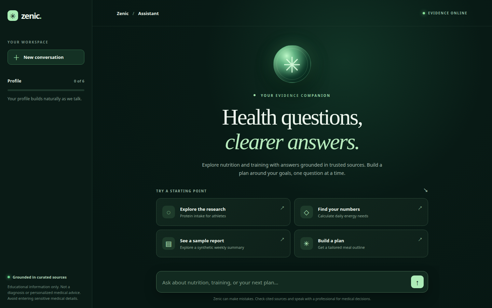
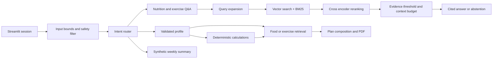

# Zenic — Health & Nutrition RAG Assistant

An evidence-focused nutrition and fitness assistant built with Python, LangGraph,
Streamlit, hybrid retrieval, and Groq. It combines a curated knowledge base with
deterministic calculators and downloadable educational plans.



**Validation:** the offline suite, live Qdrant/Groq workflows, and container checks
are recorded in [the release audit](docs/release-audit.md). This is an educational
portfolio application, not a medical device or a service for clinical decisions.

## Architecture



- **Knowledge:** 10,201 bundled passages from NIH ODS, USDA, wger, dietary
  guidelines, and ISSN. Three manually authored summaries are explicitly marked
  in their metadata; their provenance scripts remain in `scripts/oneoff/`.
- **Retrieval:** BGE-small embeddings, local Chroma or production Qdrant, BM25,
  reciprocal rank fusion, fair candidate allocation per source, deduplication by chunk identity, and BGE cross encoder
  reranking. Query embeddings are batched; models and clients are reused.
- **Grounding:** only passages scoring at least 0.5 enter factual generation.
  Whole passages fit within a 16,000-character budget. Missing evidence produces
  a static abstention. Live USDA fallback results are reranked too.
- **Citations:** evidence IDs such as `[1]` map to supplied source records.
  Missing or out-of-range IDs cause abstention. This checks citation structure,
  not whether every claim is semantically entailed by its cited passage.
- **Orchestration:** six intents: nutrition Q&A, calculations, meal plans,
  workout plans, demonstration weekly summaries, and general conversation.
  Unknown router outputs require retrieval rather than unrestricted health chat.
- **Calculations:** Mifflin–St Jeor BMR, activity-based TDEE, and
  weight-based protein and macronutrient estimates at TDEE. The calculations
  are deterministic; the model presents the results. Adult-only equation use
  and explicit physiology coefficients prevent silently applying an
  inappropriate formula.
- **Resilience:** timeouts, bounded retries, safe errors, structured logs with
  correlation IDs, and no health query or profile values in application logs.

The candidate merge uses reciprocal rank fusion so raw BM25 scores cannot overwhelm
vector similarities. Each source receives a share of the candidate budget before
unused slots are filled by rank; the cross encoder makes the final relevance judgment.

## Run locally

Use **Python 3.12**. The checked lock and container target Linux CPU execution.

```bash
python3.12 -m venv .venv
source .venv/bin/activate
pip install torch==2.13.0 --index-url https://download.pytorch.org/whl/cpu
pip install -r requirements.lock.txt
pip check
cp .env.example .env
```

Set `GROQ_API_KEY` and `ENV=development`. The default model is
`openai/gpt-oss-20b`; structured plans use `openai/gpt-oss-120b`, which handled
the nested plan schema more reliably in live validation. Set `GROQ_MODEL` and
`GROQ_PLAN_MODEL` to choose available alternatives. Plan output is validated
locally; supported models also use constrained JSON schemas. Exported environment
variables take precedence over `.env`.

The BM25 corpus ships with the repository, but the vector database does not.
Build a local vector index from the same corpus before starting:

```bash
ENV=development PYTHONPATH=. python scripts/index_corpus.py
PYTHONPATH=. python scripts/healthcheck.py --llm
streamlit run zenic/ui/app.py --server.fileWatcherType none
```

Embedding and reranking models download on first use. Once cached, set
`HF_HUB_OFFLINE=1` to avoid Hub probes. Disabling Streamlit's file watcher
avoids repeated scans of Transformers modules; restart the app after code edits.
CPU reranking can take tens of seconds. `MULTI_QUERY_ENABLED=false` avoids
query-expansion model calls when latency or provider budget matters. It can
reduce recall.

## Configuration

See [.env.example](.env.example) for all defaults and supported tuning knobs.

| Variable | Purpose |
| --- | --- |
| `GROQ_API_KEY` | Required for routing and generation |
| `GROQ_MODEL`, `GROQ_PLAN_MODEL` | Chat/routing model and structured-plan model |
| `ENV` | `development` uses Chroma; `production` uses Qdrant |
| `QDRANT_URL`, `QDRANT_API_KEY` | Required in production; HTTPS only |
| `USDA_API_KEY` | Optional food-data fallback |
| `GOOGLE_API_KEY` | Optional historical RAGAS evaluation |
| `CHROMA_PATH`, `BM25_CORPUS_PATH` | Local persistence locations |
| `MULTI_QUERY_ENABLED` | Enable query expansion, default true |
| `RETRIEVAL_TOP_K` | Final passages, default 7 |
| `RERANK_BATCH_SIZE` | Small length-sorted batches, default 4 |
| `LOG_FORMAT`, `LOG_LEVEL` | Structured or text diagnostics |

The UI keeps chat and profile state per Streamlit session. Prompts and relevant
profile fields are sent to the configured model provider; food fallback queries
are sent to USDA. Do not enter identifying or sensitive medical information.
Weekly summaries use bundled **synthetic demonstration data**, not user tracking.

## Tests and evaluation

```bash
ruff check .
pytest -m 'not integration' -q
pytest -m 'integration' -q  # configured providers and populated index required
PYTHONPATH=. python scripts/retrieval_spot_check.py
PYTHONPATH=. python scripts/ragas_eval.py
```

Offline tests cover retrieval merging, reranking, grounding, citation rejection,
configuration, HTTP failure handling, profiles, calculators, graph routing, PDF
rendering, and safety boundaries. They replace external services; they do not
establish live service health or clinical accuracy.

`eval_results/ragas_latest.json` contains a **historical** evaluation using the
previous model and prompts. It is retained for reproducibility, not advertised
as a score for the current version. The small retrieval benchmark is also not a
clinical validation dataset.

## Deployment

```bash
# Index the same bundled corpus in an existing configured Qdrant collection.
ENV=production PYTHONPATH=. python scripts/index_corpus.py
ENV=production PYTHONPATH=. python scripts/healthcheck.py --llm

docker build -t zenic .
docker run --rm --env-file .env -p 7860:7860 zenic
```

The image runs as a non-root user, excludes local secrets and raw documents,
installs pinned dependencies, and preloads embedding models. Its HTTP healthcheck
checks Streamlit liveness; `scripts/healthcheck.py --llm` checks service readiness.
The same Dockerfile supports Hugging Face Docker Spaces on port 7860.

**Before internet exposure:** deploy behind authenticated access with request and
concurrency limits, TLS, provider spending limits, and a retention policy. This
repository does not implement account authentication or a distributed rate limiter.
Keep Streamlit's default CORS and XSRF protections enabled. Do not expose a Chroma
server; the development backend uses an embedded database only.

## Repository map

- `zenic/rag/`: retrieval, generation, vector adapters, and ingestion
- `zenic/agent/`: graph, nodes, profile validation, and deterministic tools
- `zenic/safety/`: keyword filter and standalone OpenFDA research utility
- `zenic/ui/`: Streamlit interface
- `tests/`: offline regression and opt-in live integration checks
- `scripts/`: corpus indexing, ingestion, migration, health and evaluation tools
- `data/`: curated corpus and synthetic demonstration data
- `docs/release-audit.md`: validation evidence and remaining release blockers

See [CONTRIBUTING.md](CONTRIBUTING.md) and [SECURITY.md](SECURITY.md).
