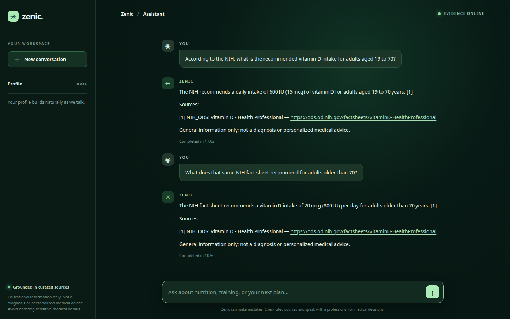
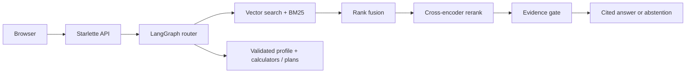

# Zenic

Zenic answers nutrition and exercise questions using a source-backed knowledge
base. It also calculates BMR and TDEE from a validated adult profile and creates
educational meal and workout PDFs.

Built with Python 3.12, LangGraph, Starlette, Groq, BGE embeddings and reranking,
and a plain HTML/CSS/JavaScript frontend.



[See the landing screen](assets/ui_landing.png)

## What it does

- Answers questions from 10,201 bundled passages covering NIH Office of Dietary
  Supplements, USDA, dietary guidelines, ISSN, and wger material.
- Handles follow-up questions, shows its sources, and abstains when retrieval
  finds no usable evidence.
- Routes calculation and plan requests through profile validation. BMR, TDEE,
  and macro estimates are calculated in code; the model explains the result.
- Generates session-scoped PDFs for meal plans, workout plans, and a weekly
  summary. The weekly data is synthetic demo data.

## How the RAG path works



The vector index uses BGE-small embeddings in local Chroma or production Qdrant.
Reciprocal rank fusion combines vector and BM25 results before a cross-encoder
reranks a bounded candidate set. Age-specific nutrient questions focus the
matching table row during ranking, and referential follow-ups are rewritten as
standalone searches.

Generation receives whole passages within a 16,000-character context budget.
Passages below the relevance threshold are excluded. The answer must cite
supplied source IDs such as `[1]`; missing or invalid IDs cause abstention. NIH
citations include validated publisher links. Citation checks verify that a source
was supplied, but cannot prove that every generated claim follows from it.

Three passages are manually authored summaries; their corpus metadata marks
them as synthetic.

## Run locally

Use Python 3.12 on Linux CPU. The BM25 corpus is included; the vector index is
built locally.

```bash
python3.12 -m venv .venv
source .venv/bin/activate
pip install torch==2.13.0 --index-url https://download.pytorch.org/whl/cpu
pip install -r requirements.lock.txt
cp .env.example .env
```

Set `GROQ_API_KEY` in `.env` and leave `ENV=development` for local Chroma. Then:

```bash
ENV=development PYTHONPATH=. python scripts/index_corpus.py
PYTHONPATH=. python scripts/healthcheck.py --llm
PYTHONPATH=. uvicorn zenic.web.app:app --host 127.0.0.1 --port 7860
```

Open <http://127.0.0.1:7860>. The embedding and reranking models download on
first use. For production Qdrant, set `ENV=production`, `QDRANT_URL`, and
`QDRANT_API_KEY`, then index the same corpus into that collection. See
[.env.example](.env.example) for model and retrieval settings.

The UI streams progress while a turn runs. In local CPU checks, cited answers
took roughly 10–29 seconds depending on retrieval and provider latency. These
are individual observations, not a latency guarantee.

## Validation

```bash
ruff check .
pytest -m 'not integration' -q
pytest -m 'integration' -q  # needs live credentials and a populated index
PYTHONPATH=. python scripts/retrieval_spot_check.py
PYTHONPATH=. python scripts/rag_vs_api_check.py
```

At the last release check, 246 offline tests passed. Ten live retrieval checks
and a six-case RAG-versus-API routing sweep also passed; two API-routing cases
were intentionally skipped in the retrieval suite because the separate sweep
covers them. Desktop and mobile browser flows and the production container were
smoke-tested. Optional RAGAS evaluation is available through
`scripts/ragas_eval.py`; generated scores are not committed because they depend
on the model, index, and provider state.

These checks establish software behavior, not clinical accuracy. The test
queries and weekly summary use synthetic data.

## Deployment and limits

The Docker image installs a smaller pinned runtime lock, preloads the embedding
models, and runs as a non-root user. With a populated Qdrant collection and
configured secrets:

```bash
docker build -t zenic .
docker run --rm --env-file .env -p 7860:7860 zenic
```

The repository does not provide account authentication or a distributed rate
limiter. Put any public deployment behind authenticated access, TLS, request
limits, a provider spending cap, and a retention policy. Browser sessions are
kept in memory for up to 30 minutes; they do not survive a server restart.
Prompts and relevant profile fields are sent to the configured model provider.
Do not enter identifying or sensitive medical information.

Zenic is an educational project, not a medical device or a tool for clinical
decisions. See [SECURITY.md](SECURITY.md) for trust boundaries and
[CONTRIBUTING.md](CONTRIBUTING.md) for development checks.

## Repository guide

- `zenic/rag/` — retrieval, vector adapters, and ingestion
- `zenic/agent/` — LangGraph routing, safety checks, calculations, and plans
- `zenic/web/` — browser UI and streaming API
- `data/` and `eval_data/` — bundled corpus, synthetic weekly data, and
  evaluation questions
- `tests/` and `scripts/` — regression checks, indexing, and evaluation tools
